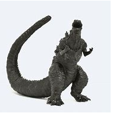

# Caleb'sMod
Mod for Caleb as he requested it.

**Current not in development as he will not install the mod**



## Build instructions
```sh
# Assuming you have CMake installed

# Configure the mod
cmake -B build

# Build
cmake --build build --config RelWithDebInfo
```

# Resources
* [Geode SDK Documentation](https://docs.geode-sdk.org/)
* [Geode SDK Source Code](https://github.com/geode-sdk/geode/)
* [Geode CLI](https://github.com/geode-sdk/cli)
* [Bindings](https://github.com/geode-sdk/bindings/)
* [Dev Tools](https://github.com/geode-sdk/DevTools)
